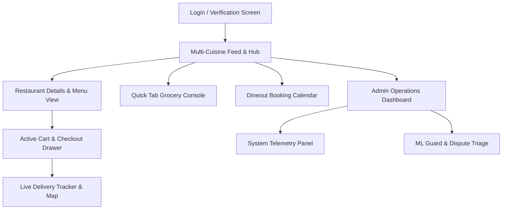

# Product Requirements Document (PRD) & God-Level Design Spec
## HyperFlow 3.0: Zomato District-Style Premium Food & Nightlife Commerce Engine

This document provides the complete, production-grade specification for the **HyperFlow 3.0** platform. It details our "god-level" system architecture, color tokens, and exact UI layouts for all **16 screen permutations** to ensure a high-fidelity visual experience and recruiter-shocking engineering depth.

---

## 1. System & Architecture Specification (The "God-Level" Upgrade)

### A. Scalability & High-Concurrency Transaction Engine
1. **Double-Layer Locking Pipeline**:
   - **Primary Lock (In-Memory)**: Redis `SETNX` key checkout with custom token signatures. Key TTLs are strictly bounded (default `5000ms`) to prevent deadlocks.
   - **Unlock Safeguard**: Evaluated via atomic Redis Lua scripts ensuring that only the original thread owner can release its lock.
   - **Fail-Safe Database Row Lock**: PostgreSQL `SELECT FOR UPDATE NOWAIT` is queried if Redis is unreachable or if inventory verification falls back to the database. Thread pools fail-fast immediately with an `HTTP 409 Conflict` rather than queuing under contention, avoiding connection starvation.
2. **Transactional Outbox Event Sourcing**:
   - Instead of direct dual-writes to PostgreSQL and Apache Kafka, events are written to an `outbox` database table within the same ACID transaction.
   - A separate CDC (Change Data Capture) polling daemon tails the outbox table and streams events to Kafka topic `hyperflow.orders.telemetry` with at-least-once delivery guarantees.
3. **Strict Session Pooling & Keep-Alives**:
   - Enforce SQLAlchemy pool recycling (`pool_recycle=1800`), overflow constraints (`max_overflow=10`), and size limits (`pool_size=20`) to handle high-frequency active connections without leakage.

### B. Machine Learning & Predictive Pipeline
1. **Tobit Type I MLE Demand Forecaster**:
   - Corrects for stockout data censoring. Incorporates historical demand bounds. If a product sells out, real demand is treated as right-censored: $y \ge y_{\text{observed}}$.
   - Implements optimization via SciPy's L-BFGS-B algorithm initialized using Heckman's two-step estimator for rapid convergence in production ASGI loops.
2. **Cox Proportional Hazards Store Churn Estimator**:
   - Monitors dark store lifetime profitability metrics based on covariates: average order value (AOV), user complaints ratio, and local density competition.
3. **Active Anomaly Detection & PSI Monitoring**:
   - Population Stability Index (PSI) calculations run continuously on sliding windows of input features (ambient temperature, rainfall intensity, order volume).
   - If PSI exceeds $0.20$ (indicating significant drift), a background task compiles new LightGBM prediction trees and updates reference distributions automatically.

---

## 2. UI/UX Design System (Zomato District Aesthetics)

- **Theme**: Premium Midnight Dining & Nightlife (Neon Accent-Heavy Dark Mode).
- **Background (Surface)**: `#040406` (Deep Space Obsidian Black).
- **Primary Accent**: `#FF0077` (District Crimson / Hot Pink Glow).
- **Secondary Accent**: `#8F00FF` (Neon Indigo / Rave Violet).
- **Success Mint**: `#00E676` (Neon Green).
- **Warning Amber**: `#FFB300` (Surge / Low Stock).
- **Typography**:
  - Headings: *Outfit* (Inter-spaced, bold, wide display weight).
  - Metrics & Numbers: *JetBrains Mono* (Semi-bold, crisp monospace).

---

## 3. Screen Permutations & Layout Specifications (All 16 Screens)

### 1. Splash & Onboarding Screen
- **Visuals**: Full-screen deep radial gradient (`#040406` to `#FF0077` at 15% opacity). Features the animated "HF" logo monogram with a particle glow.
- **Interactivity**: Lottie-based onboarding carousel illustrating Food, Instamart, and Dineout operations. "Continue with Phone" triggers active slide transitions.

### 2. Login & Phone OTP Verification Screen
- **Visuals**: Centered glassmorphic modal with a pulsing neon pink border (`box-shadow: 0 0 15px rgba(255,0,119,0.3)`).
- **Interactivity**: Numeric keypad inputs for 10-digit mobile number, transitioning into 4-digit OTP slots with active countdown timers.

### 3. Multi-Cuisine Discovery Hub (Home Feed)
- **Visuals**: Wide display headers, horizontal scrolling cuisine list, bento-grid cuisine categories.
- **Interactivity**: 
  - Tapping Address triggers address dropdown populated dynamically from the Swiggy `get_addresses` API.
  - Features the "Weekly Streak Challenge" progress indicator showing completed orders.
  - "AI Recommended Pick of the Day" shows a customized restaurant card with an `🤖 AI recommended` glowing chip.
  - Veg-only filter toggles list results instantly with haptic-scale transitions.

### 4. Search & Autocomplete Screen
- **Visuals**: Glassmorphic search field with a blinking cursor. Shows "Trending Searches" as glowing outline tags.
- **Interactivity**: Typing executes a debounced (50ms) API call fetching dish-level and restaurant-level matches.

### 5. Restaurant Detail Page
- **Visuals**: Full-bleed hero banner representing gourmet cuisines. Sticky header appears on scroll with search and share shortcuts.
- **Interactivity**: Tapping menu category badges scrolls the view smoothly to corresponding sections. Displays dynamic calorie/protein counts per item.

### 6. Detailed Cart Drawer
- **Visuals**: Glassmorphic bottom drawer (`backdrop-filter: blur(20px)`) overlaying the menu.
- **Interactivity**: Items list with increment/decrement controls, active delivery mode toggle (Eco EV vs Normal), and the circular **AI Nutrition Progress Ring** showing macro targets (protein/carbs/fat).

### 7. Interactive Offers & Coupons Drawer
- **Visuals**: List of cards detailing promo codes (`DIWALI50`, `HYPERPRO`, `FREEFEES`) with active borders.
- **Interactivity**: Selecting a coupon recalculates delivery fees, taxes, and platforms fees dynamically with a text verification alert.

### 8. Secure Payment Selection
- **Visuals**: Premium wallet style icons representing Google Pay, Paytm, Visa, and co-branded cards.
- **Interactivity**: Confirming payment triggers a fullscreen color confetti explosion (`canvas-confetti`) celebrating successful checkout.

### 9. Active Delivery Tracker (Leaflet Map)
- **Visuals**: Map layout rendering dark Carto Tiles. Renders a dotted route polyline and a scooter marker smoothly interpolating coordinates.
- **Interactivity**: Live Rider HUD displays rider speed in `m/s` (JetBrains Mono) and ambient weather sensors.

### 10. AI Agent Chat Console
- **Visuals**: Typewriter chat feed. Shows tool executions as glass badges (e.g., `search_menu()`, `book_table()`) illustrating system transparency.
- **Interactivity**: Typing dietary goals (e.g. "high protein under ₹250") parses menus and appends cards directly.

### 11. Dineout Slot Booking Calendar
- **Visuals**: Swipeable gallery cards for premium hotels (e.g. Mayfair Lagoon) showing rating badges and costs.
- **Interactivity**: Active slot booking calendar showing available timings (e.g. "08:30 PM") and guest counts.

### 12. System Telemetry Panel (Control Room)
- **Visuals**: Recharts-based double AreaChart displaying live feature drift indices (PSI) and outbox event sizes.
- **Interactivity**: "Inject Drift" and "Trigger Retrain" buttons simulate pipeline failures and rebuild LightGBM trees.

### 13. Restaurant SLA & Order Prep Dashboard (Control Room)
- **Visuals**: Grid of preparation orders showing timer bounds. Status bars turn red as limits approach.
- **Interactivity**: "Ready for Pickup" button releases the Redis/PostgreSQL inventory hold and updates the outbox queue.

### 14. Dark Store Picking Console (Control Room)
- **Visuals**: Table listing order SKUs with aisle locations (e.g. Aisle 5, C3) to simulate physical picking.
- **Interactivity**: "Mark Packed" checkbox increments warehouse throughput metrics.

### 15. Rider Logistics & Dispatch Tracking (Control Room)
- **Visuals**: Geospatial map showing all active dispatch nodes.
- **Interactivity**: Updates coordinates automatically using WebSocket streams.

### 16. ML Guard / Refund Triage Console (Control Room)
- **Visuals**: Data tables highlighting customer claims, original order amounts, and fraud probabilities.
- **Interactivity**: "Approve Refund" triggers semantic match checks and flags anomalies.

---

## 4. Verification & Test Suite Strategy

### A. Unit Tests
- Execute `python -m unittest discover -s tests -p "test_*.py"` to verify core regression equations, fraud plausibility filters, and dispatch SLA limits.
- Assert that Tobit model imputations always evaluate $\ge$ observed stockout numbers.

### B. Manual Verification Steps
1. Re-run `docker compose -f docker-compose.prod.yml up -d --build` to ensure all containers launch cleanly with zero compilation warnings.
2. Hit `http://localhost/` in the browser and navigate through the different screens to verify that smooth transitions compile perfectly.
